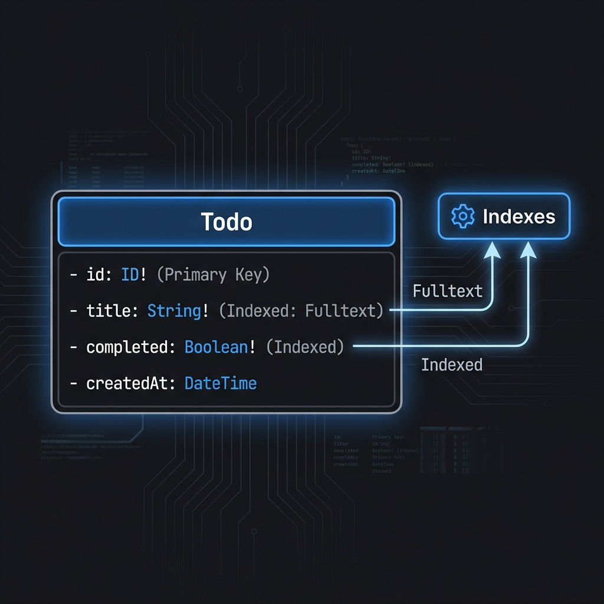
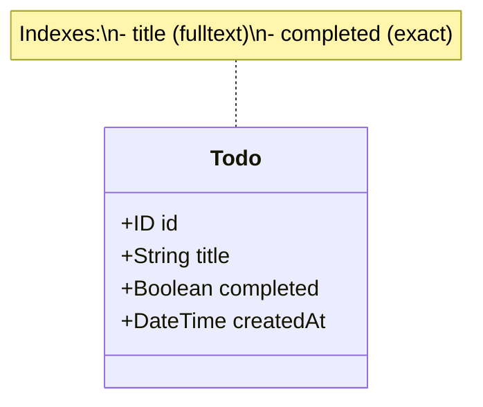
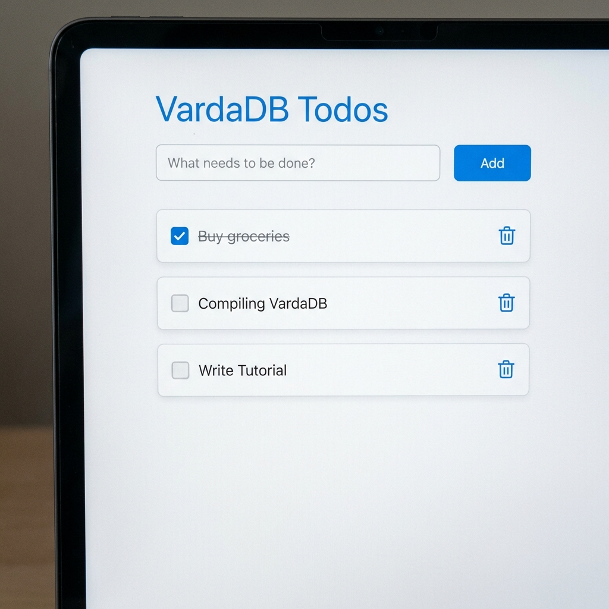

# Building a production-ready Todo App with VardaDB

In this tutorial, we will build a full-stack Todo application using **VardaDB** as the backend and **React** (with Mantine & TanStack Router) as the frontend.

We will cover:
1.  Setting up VardaDB.
2.  Designing a Schema with Indexes.
3.  Exploring the GraphQL API.
4.  Building the React Frontend step-by-step.

---

## Part 1: Setting up VardaDB

VardaDB is a high-performance, embedded GraphQL database written in Rust.

### 1. Prerequisities
- **Rust Toolchain**: [Install Rust](https://rustup.rs/) (`curl --proto '=https' --tlsv1.2 -sSf https://sh.rustup.rs | sh`)
- **Node.js**: [Install Node.js](https://nodejs.org/) (v18+)

### 2. Clone and Compile
First, get the VardaDB source code and compile it.

```bash
# Clone the repository
git clone https://github.com/varda-org/vardadb.git
cd vardadb

# Run the server (this compiles the project first, which may take a minute)
cargo run -- start
```

You should see output indicating the server is running, typically on port `8000`:
```
Server running at http://127.0.0.1:8000
GraphiQL playground at http://127.0.0.1:8000/playground
```

---

## Part 2: Schema Design

For a Todo app, we need to store tasks. Each task has a title, a completion status, and a unique ID. We also want to search for tasks by title.

### The Schema

Create a file named `schema.graphql` (or just define it in your VardaDB config if supported, for now VardaDB loads from its internal schema source or CLI). *For this tutorial, we assume VardaDB is running with its default dynamic schema capability.*

```graphql
type Todo {
    id: ID!
    title: String! @search(by: [fulltext])
    completed: Boolean! @search
    createdAt: DateTime
}
```

### Explanation of Directives
- **`id: ID!`**: The unique identifier for each Todo node. VardaDB manages this automatically.
- **`@search(by: [fulltext])`**: This tells VardaDB to create a **Full-Text Index** on the `title` field. This allows us to perform advanced search queries like "contains word", not just exact equality.
- **`@search` on boolean**: Creates a simple index to quickly filter by `completed: true` or `false`.

### Schema Visualization






### Apply the Schema

Once you have created your `schema.graphql`, apply it to the running VardaDB server using the admin endpoint:

```bash
curl -X POST localhost:8000/admin/schema --data-binary '@schema.graphql'
```

You should see a success message. VardaDB has now generated the GraphQL API for your `Todo` type, including queries, mutations, and the search index.


---

## Part 3: Building the React Frontend


### UI Preview


Now let's build the UI using **React**, **Vite**, **TanStack Router**, and **Mantine**.

### 1. Scaffold the Project

```bash
npm create vite@latest todo-app -- --template react-ts
cd todo-app
npm install
```

### 2. Install Dependencies

```bash
# Core
npm install @mantine/core @mantine/hooks @mantine/notifications @tanstack/react-router graphql-request swr @tabler/icons-react
# Realtime & UI Feedback
npm install graphql-ws 
# Dev Tools (Required for Route Generation)
npm install -D @tanstack/router-plugin @tanstack/router-devtools
```

### 3. Configure Vite (`vite.config.ts`)

Update your `vite.config.ts` to include the TanStack Router plugin. This is critical for auto-generating the `routeTree.gen.ts`.

```typescript
import { defineConfig } from 'vite'
import react from '@vitejs/plugin-react'
import { TanStackRouterVite } from '@tanstack/router-plugin/vite'

// https://vitejs.dev/config/
export default defineConfig({
  plugins: [
    TanStackRouterVite(),
    react(),
  ],
})
```

### 4. Setup Client (`src/client.ts`)

Create a simple GraphQL client wrapper.

```typescript
import { GraphQLClient } from 'graphql-request';

export const client = new GraphQLClient('http://127.0.0.1:9000/graphql');

export const QUERIES = {
  listTodos: `
    query ListTodos {
      queryTodo {
        id
        title
        completed
      }
    }
  `,
  createTodo: `
    mutation CreateTodo($title: String!) {
      createTodo(input: { title: $title, completed: false }) {
        id
      }
    }
  `,
  toggleTodo: `
    mutation UpdateTodo($id: ID!, $completed: Boolean!) {
      updateTodo(id: $id, input: { completed: $completed })
    }
  `,
  deleteTodo: `
    mutation DeleteTodo($id: ID!) {
      deleteTodo(id: $id)
    }
  `
};
```

### 5. Setup Routes (`src/routes/__root.tsx`)

Setting up MantineProvider and the Router root.

```tsx
import { createRootRoute, Outlet } from '@tanstack/react-router'
import { MantineProvider, Container, Title } from '@mantine/core';

export const Route = createRootRoute({
  component: () => (
    <MantineProvider>
      <Container size="sm" py="xl">
        <Title order={1} mb="lg">VardaDB Todos</Title>
        <Outlet />
      </Container>
    </MantineProvider>
  ),
})
```

### 6. Build the Todo List (`src/routes/index.tsx`)

This is the main interaction logic.

```tsx
import { createFileRoute } from '@tanstack/react-router'
import { TextInput, Button, Group, Stack, Checkbox, ActionIcon, Paper, Text } from '@mantine/core';
import { useInputState } from '@mantine/hooks';
import { IconTrash, IconSearch } from '@tabler/icons-react';
import useSWR from 'swr';
import { client, QUERIES } from '../client';

export const Route = createFileRoute('/')({
  component: Index,
})

function Index() {
  const [newTodo, setNewTodo] = useInputState('');
  const [search, setSearch] = useInputState('');
  
  // Data Fetching
  const { data, mutate } = useSWR('todos', async () => client.request(QUERIES.listTodos));
  const todos = data?.queryTodo || [];

  // Filtering on client side for simplicity (or use VardaDB filter)
  const filteredTodos = todos.filter((t: any) => 
    t.title.toLowerCase().includes(search.toLowerCase())
  );

  const handleCreate = async () => {
    if (!newTodo) return;
    await client.request(QUERIES.createTodo, { title: newTodo });
    setNewTodo('');
    mutate(); // Refresh list
  };

  const handleToggle = async (id: string, current: boolean) => {
    await client.request(QUERIES.toggleTodo, { id, completed: !current });
    mutate();
  };

  const handleDelete = async (id: string) => {
    await client.request(QUERIES.deleteTodo, { id });
    mutate();
  };

  return (
    <Stack>
      {/* Input Section */}
      <Group>
        <TextInput 
          placeholder="What needs to be done?" 
          value={newTodo} 
          onChange={setNewTodo} 
          style={{ flex: 1 }}
        />
        <Button onClick={handleCreate}>Add</Button>
      </Group>

      {/* Search Section */}
      {todos.length > 0 && (
         <TextInput 
            icon={<IconSearch size={14} />}
            placeholder="Search todos..."
            value={search}
            onChange={setSearch}
            variant="filled"
         />
      )}

      {/* Todo List */}
      <Stack>
        {filteredTodos.map((todo: any) => (
          <Paper key={todo.id} p="md" shadow="xs" withBorder>
            <Group position="apart">
              <Group>
                <Checkbox 
                  checked={todo.completed} 
                  onChange={() => handleToggle(todo.id, todo.completed)}
                />
                <Text td={todo.completed ? 'line-through' : undefined}>
                  {todo.title}
                </Text>
              </Group>
              <ActionIcon color="red" onClick={() => handleDelete(todo.id)}>
                <IconTrash size={18} />
              </ActionIcon>
            </Group>
          </Paper>
        ))}
        {todos.length === 0 && <Text>No tasks yet.</Text>}
      </Stack>
    </Stack>
  )
}
```

### 7. Setup Router (`src/main.tsx`)

Finally, wire it all together.

```tsx
import React from 'react'
import ReactDOM from 'react-dom/client'
import { RouterProvider, createRouter } from '@tanstack/react-router'
import { routeTree } from './routeTree.gen' // TanStack router auto-generates this

const router = createRouter({ routeTree })

ReactDOM.createRoot(document.getElementById('root')!).render(
  <React.StrictMode>
    <RouterProvider router={router} />
  </React.StrictMode>,
)
```


## Part 4: Realtime Features

VardaDB supports real-time subscriptions over WebSockets. Let's add live notifications when Todos are created or deleted.

### 1. Enable Notifications (`src/routes/__root.tsx`)

Wrap your app with `Notifications`.

```tsx
import { createRootRoute, Outlet } from '@tanstack/react-router'
import { MantineProvider, Container, Title } from '@mantine/core';
import { Notifications } from '@mantine/notifications';

export const Route = createRootRoute({
  component: () => (
    <MantineProvider>
      <Notifications />
      <Container size="sm" py="xl">
        <Title order={1} mb="lg">VardaDB Todos</Title>
        <Outlet />
      </Container>
    </MantineProvider>
  ),
})
```

### 2. Setup WebSocket Client (`src/realtime.ts`)

Create a dedicated client for subscriptions using `graphql-ws`.

```typescript
import { createClient } from 'graphql-ws';

export const wsClient = createClient({
  url: 'ws://127.0.0.1:9000/graphql',
});
```

### 3. Listen for Events (`src/routes/index.tsx`)

Update your main component to subscribe to the generic `event` stream. This stream notifies you of any mutation (Create, Update, Delete) on specified types.

```tsx
// Add imports
import { useEffect } from 'react';
import { notifications } from '@mantine/notifications';
import { wsClient } from '../realtime';

// ... inside Index component ...

  // Realtime Subscription
  useEffect(() => {
    const unsubscribe = wsClient.subscribe(
      {
        query: `
          subscription {
            event(types: ["Todo"]) {
              mutation
              uid
            }
          }
        `,
      },
      {
        next: (data: any) => {
          const event = data?.data?.event;
          if (!event) return;

          if (event.mutation === 'CREATE') {
             notifications.show({
                title: 'New Todo Created',
                message: `Todo ID: ${event.uid}`,
                color: 'green',
             });
             mutate(); // Refresh list automatically
          } else if (event.mutation === 'DELETE') {
             notifications.show({
                title: 'Todo Deleted',
                message: `Todo ID: ${event.uid}`,
                color: 'red',
             });
             mutate(); // Refresh list automatically
          }
        },
        error: (err) => console.error('Subscription error:', err),
        complete: () => console.log('Subscription closed'),
      },
    );

    return () => unsubscribe();
  }, [mutate]);

// ... rest of component ...
```

## Running the App

1.  Start VardaDB Backend: `cargo run -- start` (Port 9000)
2.  Start React Frontend: `npm run dev` (Port 5173)

Open `http://localhost:5173`. You now have a high-performance, graph-backed Todo app running on VardaDB!
