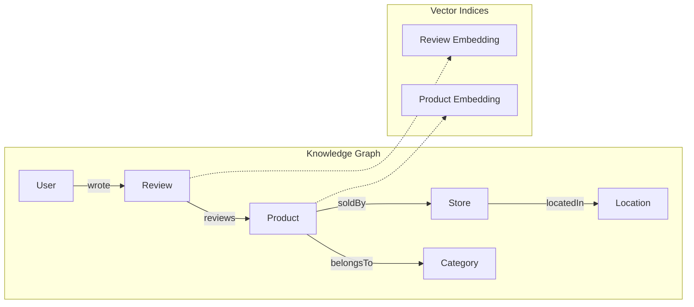

# VardaDB Vector Search: Complete Tutorial

This tutorial demonstrates **every vector engine capability** using a realistic e-commerce knowledge graph with thousands of records, complex relationships, and comprehensive search patterns.

## Architecture Overview



---

## 1. Schema Definition

Create this schema in your VardaDB instance:

```graphql
# E-Commerce Knowledge Graph Schema
# Demonstrates: @vector, @search, @hasInverse, @unique

type Category {
    id: ID!
    name: String! @unique @search(by: [term])
    products: [Product] @hasInverse(field: "category")
}

type Store {
    id: ID!
    name: String! @search(by: [fulltext])
    location: Location @hasInverse(field: "stores")
    products: [Product] @hasInverse(field: "store")
    rating: Float
}

type Location {
    id: ID!
    city: String! @search(by: [term])
    country: String! @search(by: [term])
    stores: [Store] @hasInverse(field: "location")
}

type User {
    id: ID!
    username: String! @unique
    email: String @unique
    reviews: [Review] @hasInverse(field: "author")
}

type Product {
    id: ID!
    name: String! @search(by: [fulltext])
    description: String @search(by: [fulltext])
    price: Float!
    embedding: [Float!]! @vector
    category: Category @hasInverse(field: "products")
    store: Store @hasInverse(field: "products")
    reviews: [Review] @hasInverse(field: "product")
}

type Review {
    id: ID!
    title: String @search(by: [fulltext])
    content: String! @search(by: [fulltext])
    rating: Int!
    embedding: [Float!]! @vector
    author: User @hasInverse(field: "reviews")
    product: Product @hasInverse(field: "reviews")
}
```

### Key Features Used

| Directive | Purpose | Example |
|-----------|---------|---------|
| `@vector` | HNSW vector index | `embedding: [Float!]! @vector` |
| `@search(by: [fulltext])` | BM25 text search | `name: String! @search(by: [fulltext])` |
| `@search(by: [term])` | Exact term match | `city: String! @search(by: [term])` |
| `@hasInverse` | Bidirectional edges | `products: [Product] @hasInverse(field: "category")` |
| `@unique` | Unique constraint | `username: String! @unique` |

---

## 2. Python Data Loader

Save this as `load_data.py` in the tutorial directory:

```python
#!/usr/bin/env python3
"""
VardaDB E-Commerce Data Loader
Generates thousands of records with vectors and relationships.

Requirements:
    pip install httpx numpy faker
    
Usage:
    python load_data.py --url http://localhost:4000/graphql --products 1000 --reviews 5000
"""

import httpx
import numpy as np
from faker import Faker
import argparse
import random
import time
from concurrent.futures import ThreadPoolExecutor, as_completed

fake = Faker()

# Configuration
VECTOR_DIM = 128  # Embedding dimension
CATEGORIES = ["Electronics", "Clothing", "Books", "Home", "Sports", "Toys", "Food", "Beauty"]
CITIES = [
    ("New York", "USA"), ("Los Angeles", "USA"), ("London", "UK"),
    ("Paris", "France"), ("Tokyo", "Japan"), ("Sydney", "Australia"),
    ("Berlin", "Germany"), ("Toronto", "Canada")
]

def generate_embedding(seed_text: str) -> list:
    """Generate deterministic pseudo-embedding from text."""
    np.random.seed(hash(seed_text) % (2**32))
    vec = np.random.randn(VECTOR_DIM)
    vec = vec / np.linalg.norm(vec)  # Normalize
    return vec.tolist()

def gql_request(url: str, query: str, variables: dict = None) -> dict:
    """Execute GraphQL request."""
    payload = {"query": query}
    if variables:
        payload["variables"] = variables
    resp = httpx.post(url, json=payload, timeout=30.0)
    resp.raise_for_status()
    return resp.json()

class DataLoader:
    def __init__(self, url: str):
        self.url = url
        self.category_ids = {}
        self.location_ids = {}
        self.store_ids = []
        self.user_ids = []
        self.product_ids = []
    
    def create_categories(self):
        """Create category nodes."""
        print("Creating categories...")
        for cat in CATEGORIES:
            mutation = '''
            mutation CreateCategory($name: String!) {
                createCategory(input: { name: $name }) { id }
            }
            '''
            result = gql_request(self.url, mutation, {"name": cat})
            if "data" in result and result["data"]["createCategory"]:
                self.category_ids[cat] = result["data"]["createCategory"]["id"]
        print(f"  Created {len(self.category_ids)} categories")
    
    def create_locations(self):
        """Create location nodes."""
        print("Creating locations...")
        for city, country in CITIES:
            mutation = '''
            mutation CreateLocation($city: String!, $country: String!) {
                createLocation(input: { city: $city, country: $country }) { id }
            }
            '''
            result = gql_request(self.url, mutation, {"city": city, "country": country})
            if "data" in result and result["data"]["createLocation"]:
                self.location_ids[(city, country)] = result["data"]["createLocation"]["id"]
        print(f"  Created {len(self.location_ids)} locations")
    
    def create_stores(self, count: int = 50):
        """Create store nodes linked to locations."""
        print(f"Creating {count} stores...")
        for i in range(count):
            loc = random.choice(list(self.location_ids.keys()))
            mutation = '''
            mutation CreateStore($name: String!, $rating: Float!, $location: String!) {
                createStore(input: { 
                    name: $name, 
                    rating: $rating,
                    location: $location
                }) { id }
            }
            '''
            result = gql_request(self.url, mutation, {
                "name": fake.company(),
                "rating": round(random.uniform(3.0, 5.0), 1),
                "location": self.location_ids[loc]
            })
            if "data" in result and result["data"]["createStore"]:
                self.store_ids.append(result["data"]["createStore"]["id"])
        print(f"  Created {len(self.store_ids)} stores")
    
    def create_users(self, count: int = 200):
        """Create user nodes."""
        print(f"Creating {count} users...")
        for i in range(count):
            mutation = '''
            mutation CreateUser($username: String!, $email: String!) {
                createUser(input: { username: $username, email: $email }) { id }
            }
            '''
            result = gql_request(self.url, mutation, {
                "username": f"{fake.user_name()}_{i}",
                "email": f"user{i}_{fake.email()}"
            })
            if "data" in result and result["data"]["createUser"]:
                self.user_ids.append(result["data"]["createUser"]["id"])
        print(f"  Created {len(self.user_ids)} users")
    
    def create_products(self, count: int = 1000):
        """Create product nodes with vectors."""
        print(f"Creating {count} products with embeddings...")
        start = time.time()
        
        for i in range(count):
            cat = random.choice(CATEGORIES)
            name = f"{fake.word().title()} {fake.word().title()} {cat}"
            desc = fake.paragraph(nb_sentences=3)
            
            mutation = '''
            mutation CreateProduct($input: ProductInput!) {
                createProduct(input: $input) { id }
            }
            '''
            result = gql_request(self.url, mutation, {
                "input": {
                    "name": name,
                    "description": desc,
                    "price": round(random.uniform(9.99, 999.99), 2),
                    "embedding": generate_embedding(name + desc),
                    "category": self.category_ids[cat],
                    "store": random.choice(self.store_ids)
                }
            })
            if "data" in result and result["data"]["createProduct"]:
                self.product_ids.append(result["data"]["createProduct"]["id"])
            
            if (i + 1) % 100 == 0:
                elapsed = time.time() - start
                rate = (i + 1) / elapsed
                print(f"  Progress: {i+1}/{count} ({rate:.1f} products/sec)")
        
        print(f"  Created {len(self.product_ids)} products")
    
    def create_reviews(self, count: int = 5000):
        """Create review nodes with vectors, linking users and products."""
        print(f"Creating {count} reviews with embeddings...")
        start = time.time()
        
        for i in range(count):
            title = fake.sentence(nb_words=6)
            content = fake.paragraph(nb_sentences=4)
            
            mutation = '''
            mutation CreateReview($input: ReviewInput!) {
                createReview(input: $input) { id }
            }
            '''
            result = gql_request(self.url, mutation, {
                "input": {
                    "title": title,
                    "content": content,
                    "rating": random.randint(1, 5),
                    "embedding": generate_embedding(title + content),
                    "author": random.choice(self.user_ids),
                    "product": random.choice(self.product_ids)
                }
            })
            
            if (i + 1) % 500 == 0:
                elapsed = time.time() - start
                rate = (i + 1) / elapsed
                print(f"  Progress: {i+1}/{count} ({rate:.1f} reviews/sec)")
        
        print(f"  Created {count} reviews")

    def run(self, products: int, reviews: int):
        """Run the full data loading pipeline."""
        print("=" * 60)
        print("VardaDB E-Commerce Data Loader")
        print("=" * 60)
        
        self.create_categories()
        self.create_locations()
        self.create_stores(count=50)
        self.create_users(count=200)
        self.create_products(count=products)
        self.create_reviews(count=reviews)
        
        print("=" * 60)
        print("Data loading complete!")
        print(f"  Categories: {len(self.category_ids)}")
        print(f"  Locations:  {len(self.location_ids)}")
        print(f"  Stores:     {len(self.store_ids)}")
        print(f"  Users:      {len(self.user_ids)}")
        print(f"  Products:   {len(self.product_ids)}")
        print(f"  Reviews:    {reviews}")
        print("=" * 60)

if __name__ == "__main__":
    parser = argparse.ArgumentParser(description="Load e-commerce data into VardaDB")
    parser.add_argument("--url", default="http://localhost:4000/graphql", help="GraphQL endpoint")
    parser.add_argument("--products", type=int, default=1000, help="Number of products")
    parser.add_argument("--reviews", type=int, default=5000, help="Number of reviews")
    args = parser.parse_args()
    
    loader = DataLoader(args.url)
    loader.run(products=args.products, reviews=args.reviews)
```

### Running the Loader

```bash
# Install dependencies
pip install httpx numpy faker

# Start VardaDB (assuming it's running on port 4000)
cargo run

# Load data (in another terminal)
cd tutorial/vector
python load_data.py --products 1000 --reviews 5000
```

---

## 3. Search Operations

### 3.1 Pure Vector Search (Semantic)

Find products semantically similar to a query:

```graphql
query SemanticProductSearch {
    search(
        vector: [0.12, -0.34, 0.56, ...],  # 128-dim query vector
        k: 10
    ) {
        uid
        distance
    }
}
```

**Use Case**: "Find products similar to this customer's recent purchase"

### 3.2 BM25 Text Search (Keyword)

Find products by keyword matching:

```graphql
query KeywordSearch {
    queryProduct(filter: {
        name: { alloftext: "wireless headphones" }
    }, first: 10) {
        id
        name
        price
    }
}
```

**Use Case**: "User types 'wireless headphones' in search bar"

### 3.3 Hybrid Search (BM25 + Vector)

Combine keyword relevance with semantic similarity using Reciprocal Rank Fusion:

```graphql
query HybridSearch {
    hybridSearch(
        text: "comfortable noise cancelling",
        field: "description",
        vector: [0.12, -0.34, 0.56, ...],
        k: 20
    ) {
        uid
        distance
    }
}
```

**Use Case**: "User searches for 'comfortable noise cancelling' and we boost semantically similar products"

---

## 4. Graph Traversal Patterns

### 4.1 Forward Traversal (Out)

Navigate from User → Reviews → Products:

```graphql
query UserPurchaseHistory {
    getUser(id: "user123") {
        username
        reviews {
            rating
            product {
                name
                price
                category { name }
            }
        }
    }
}
```

### 4.2 Reverse Traversal (In via @hasInverse)

Navigate from Product → Reviews → Users:

```graphql
query ProductReviewers {
    getProduct(id: "prod456") {
        name
        reviews {
            rating
            content
            author {
                username
            }
        }
    }
}
```

### 4.3 Multi-Hop Traversal

Navigate Location → Stores → Products → Reviews:

```graphql
query LocationPopularProducts {
    getLocation(id: "loc789") {
        city
        country
        stores {
            name
            products(first: 5) {
                name
                reviews {
                    rating
                }
            }
        }
    }
}
```

---

## 5. Combined Patterns: GraphRAG

### 5.1 Vector Search → Graph Expansion

First find semantically similar reviews, then expand to get full context:

```python
# Step 1: Vector search for similar reviews
similar_reviews = """
query {
    search(vector: [...], k: 5) { uid distance }
}
"""

# Step 2: Expand to full graph context
for review_uid in results:
    context = f"""
    query {{
        getReview(id: "{review_uid}") {{
            content
            rating
            author {{ username }}
            product {{
                name
                price
                category {{ name }}
                store {{
                    name
                    location {{ city country }}
                }}
            }}
        }}
    }}
    """
```

### 5.2 Filter by Graph → Vector Rank

First filter by category, then rank by vector similarity:

```graphql
# Step 1: Get all Electronics products
query {
    queryProduct(filter: {
        category: { name: { eq: "Electronics" } }
    }) {
        id
        embedding  # Get vectors for client-side ranking
    }
}

# Then client-side: rank by cosine similarity to query vector
```

---

## 6. Update and Delete Operations

### 6.1 Update Vector

```graphql
mutation UpdateProductEmbedding {
    updateProduct(id: "prod123", input: {
        embedding: [0.15, 0.92, -0.28, ...]  # New 128-dim vector
    })
}
```

> [!IMPORTANT]
> Vector dimensions must match. All vectors in VardaDB share a global dimension.

### 6.2 Delete Node (Cascading Vector Removal)

```graphql
mutation DeleteProduct {
    deleteProduct(id: "prod123")
}
```

After deletion:
- ✅ Product removed from graph
- ✅ Vector removed from HNSW index  
- ✅ Product no longer appears in `search` results
- ✅ Inverse edges (Store→Product, Category→Product) cleaned up

---

## 7. Performance Benchmarking

### Test Script

```python
#!/usr/bin/env python3
"""Benchmark VardaDB search performance."""

import httpx
import numpy as np
import time

URL = "http://localhost:4000/graphql"
VECTOR_DIM = 128
ITERATIONS = 100

def benchmark_vector_search():
    query = """
    query VectorSearch($vec: [Float!]!, $k: Int!) {
        search(vector: $vec, k: $k) { uid distance }
    }
    """
    
    latencies = []
    for _ in range(ITERATIONS):
        vec = np.random.randn(VECTOR_DIM).tolist()
        start = time.perf_counter()
        resp = httpx.post(URL, json={"query": query, "variables": {"vec": vec, "k": 10}})
        latency = (time.perf_counter() - start) * 1000
        latencies.append(latency)
    
    print(f"Vector Search (k=10):")
    print(f"  p50: {np.percentile(latencies, 50):.2f}ms")
    print(f"  p95: {np.percentile(latencies, 95):.2f}ms")
    print(f"  p99: {np.percentile(latencies, 99):.2f}ms")

def benchmark_hybrid_search():
    query = """
    query HybridSearch($text: String!, $field: String!, $vec: [Float!]!, $k: Int!) {
        hybridSearch(text: $text, field: $field, vector: $vec, k: $k) { uid distance }
    }
    """
    
    keywords = ["wireless", "comfortable", "premium", "budget", "compact"]
    latencies = []
    
    for i in range(ITERATIONS):
        vec = np.random.randn(VECTOR_DIM).tolist()
        start = time.perf_counter()
        resp = httpx.post(URL, json={
            "query": query,
            "variables": {
                "text": keywords[i % len(keywords)],
                "field": "description",
                "vec": vec,
                "k": 10
            }
        })
        latency = (time.perf_counter() - start) * 1000
        latencies.append(latency)
    
    print(f"Hybrid Search (k=10):")
    print(f"  p50: {np.percentile(latencies, 50):.2f}ms")
    print(f"  p95: {np.percentile(latencies, 95):.2f}ms")
    print(f"  p99: {np.percentile(latencies, 99):.2f}ms")

if __name__ == "__main__":
    print("=" * 50)
    print("VardaDB Search Benchmark")
    print("=" * 50)
    benchmark_vector_search()
    benchmark_hybrid_search()
```

---

## 8. Limitations & Best Practices

| Limitation | Workaround |
|------------|------------|
| Single dimension per DB | Use separate VardaDB instances for different embedding models |
| One @vector field per type | Use Satellite Node Pattern (see Section 7 of basic tutorial) |
| No filtered vector search | Filter by graph first, then vector rank client-side |

### Best Practices

1. **Normalize vectors** before insertion (unit length for cosine similarity)
2. **Use consistent embedding models** across all data
3. **Index text fields** with `@search` for hybrid queries
4. **Define `@hasInverse`** on all relationships for bidirectional traversal

---

## Quick Reference

| Operation | GraphQL |
|-----------|---------|
| Vector Search | `search(vector: [...], k: N) { uid distance }` |
| Hybrid Search | `hybridSearch(text: "...", field: "...", vector: [...], k: N) { uid distance }` |
| Text Search | `queryType(filter: { field: { alloftext: "..." } })` |
| Create with Vector | `createType(input: { ..., embedding: [...] })` |
| Update Vector | `updateType(id: "...", input: { embedding: [...] })` |
| Delete | `deleteType(id: "...")` |
